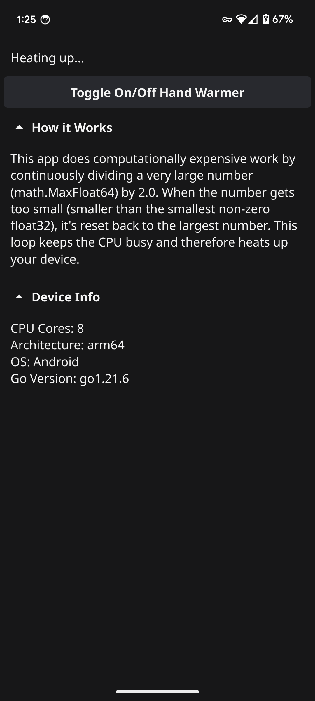

# Ember: Hand Warmer App

Ember is a simple app that helps warm your hands by utilizing your device's CPU.

## Features

* Toggle on/off hand warmer functionality
* Learn how the app works
* Cross platform (Should work on Linux, Windows, MacOS, Android, and iOS)
* View device information like CPU cores, architecture, OS, and Go version.

## Screenshots

## Download

Download the latest release from [the releases](https://github.com/radeeyate/ember/releases).

## Building the App

Requirements:

* Go compiler and environment setup

Steps:

1. Clone the repo `git clone https://github.com/radeeyate/ember.git`
1. Navigate to the directory `cd ember`
1. `go get`
1. Build the app:
    * `go build .` for Linux, Windows, and MacOS
    * `fyne package -os android` for Android
        * to build for Android you need Android Studio + NDK
    * `fyne package -os ios` for iOS
        * to build for iOS you need Xcode + CocoaPods probably

You will either get a binary or .apk/.app.

Listen I don't want to write these so it might be wrong. I do not care. Just make an issue if there's a problem.
